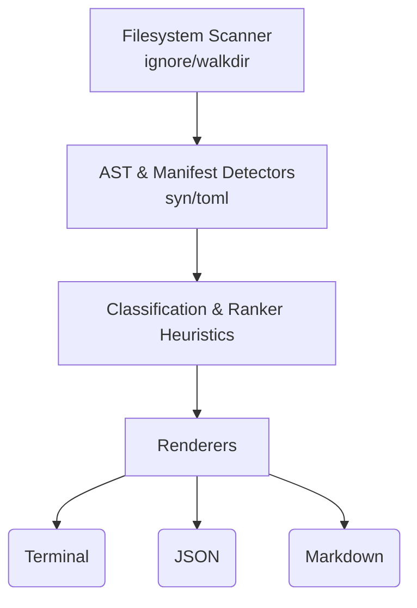

# StellarPath CLI

[](https://github.com/STELLAR-PATH/stellarpath-cli/actions)
[](LICENSE)
[](https://www.rust-lang.org)
[](https://soroban.stellar.org)

## Core Value Proposition
StellarPath solves cold-start latency and cognitive overload for new developers exploring Stellar and Soroban monorepos. By deterministically scanning repositories and automatically classifying architectures, StellarPath guides developers exactly where they need to start—eliminating hours of manual repository exploration.

## Architecture & Pipeline



## Quick Start

### Installation

```bash
# Install directly from the repository
cargo install --path .

# Or build the release binary manually
cargo build --release
```

### Usage

Run StellarPath in the root of any Stellar or Soroban repository:

```bash
stellarpath-cli
```

Format output as JSON:

```bash
stellarpath-cli --format json
```

Format output as Markdown:

```bash
stellarpath-cli --format markdown
```

### Example Output

```
$ stellarpath-cli
==================================================
StellarPath Analysis Report
==================================================

Project Archetype: Full-Stack Stellar / Soroban Monorepo

Languages Detected:
- Rust
- TypeScript/JavaScript

Recommendations:
1. Review Documentation: Start by reading the project documentation to understand its structure. (Read this file) -> README.md
2. Explore Smart Contracts: Soroban smart contracts are a core part of this project. (Review contract implementation) -> src/contract.rs
3. Run Tests: A Rust project was detected. (cargo test) -> Cargo.toml
==================================================
```

## Project Roadmap
- [x] **v0.1.0:** Core AST detection and heuristic classification
- [x] **v0.1.0:** Terminal, JSON, and Markdown rendering
- [ ] **v0.2.0:** Authorization flow graph generation
- [ ] **v0.2.0:** Developer telemetry integration
- [ ] **v0.2.0:** Custom detector plugin support

## Acknowledgements & Ecosystem

StellarPath is an open-source initiative dedicated to advancing developer tooling, contract architecture inspection, and developer experience across the Stellar and Soroban ecosystems.
