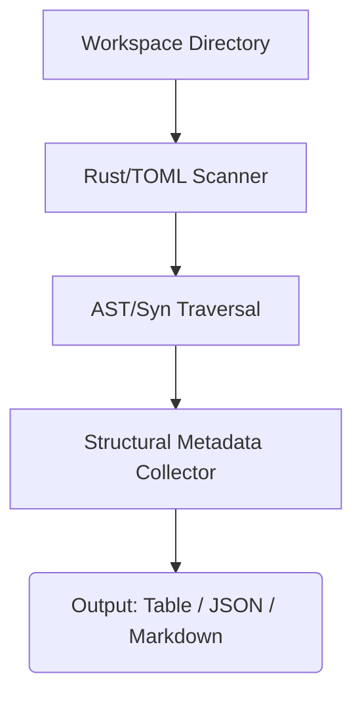

# StellarPath CLI

[](https://github.com/STELLAR-PATH/stellarpath-cli/actions)
[](LICENSE)
[](https://www.rust-lang.org)
[](https://soroban.stellar.org)

## Core Purpose
A deterministic repository intelligence CLI for Stellar and Soroban smart contract workspaces.

## Features

### Empirical Validation & Benchmark
| Target Architecture | Ecosystem Category | Contracts Detected | Auth Call Sites | Storage Analysis | Scan Latency |
| :--- | :--- | :--- | :--- | :--- | :--- |
| `soroban-examples/auth` | Access Control Reference | 2 (`AuthContract`, `CustomAccount`) | 4 (`require_auth`) | Instance | ~12ms |
| `soroban-examples/token` | SEP-41 Reference | 1 (`Token`) | 6 (`require_auth_for_args`) | Instance / Persistent | ~14ms |
| `soroban-examples/liquidity_pool` | Automated Market Maker | 1 (`LiquidityPool`) | 3 (`require_auth`) | Persistent | ~18ms |

## Architecture & Pipeline



## Quick Start

### Installation

```bash
# Install directly from the repository
cargo install --path .

# Or build the release binary manually
cargo build --release
```

### Usage

Run StellarPath in the root of any Stellar or Soroban repository:

```bash
stellarpath-cli
```

Format output as JSON:

```bash
stellarpath-cli --format json
```

Format output as Markdown:

```bash
stellarpath-cli --format markdown
```

### Example Output

```
$ stellarpath-cli
==================================================
StellarPath Analysis Report
==================================================

Project Archetype: Full-Stack Stellar / Soroban Monorepo

Languages Detected:
- Rust
- TypeScript/JavaScript

Recommendations:
1. Review Documentation: Start by reading the project documentation to understand its structure. (Read this file) -> README.md
2. Explore Smart Contracts: Soroban smart contracts are a core part of this project. (Review contract implementation) -> src/contract.rs
3. Run Tests: A Rust project was detected. (cargo test) -> Cargo.toml
==================================================
```

## Exit Codes & Troubleshooting

StellarPath uses standardized process exit codes for deterministic integration in CI/CD pipelines and developer tooling:

| Exit Code | Status | Description |
| :---: | :--- | :--- |
| `0` | **Success** | Repository scan completed and report successfully generated. |
| `1` | **Analysis / Render Error** | AST parsing failure on malformed Rust files or report formatting/rendering error. |
| `2` | **Invalid Target Path** | The specified target directory or `Cargo.toml` path does not exist. |

### Troubleshooting

- **Exit Code 1 (AST Parse Error):** Verify that all target `.rs` files contain valid Rust syntax and can be parsed by `syn`.
- **Exit Code 2 (Path Not Found):** Ensure the target path passed to `stellarpath scan <PATH>` or `stellarpath start <PATH>` is valid and accessible.

## Project Roadmap
- [x] **v0.1.0:** Core AST detection and heuristic classification
- [x] **v0.1.0:** Terminal, JSON, and Markdown rendering
- [ ] **v0.2.0:** Authorization flow graph generation
- [ ] **v0.2.0:** Developer telemetry integration
- [ ] **v0.2.0:** Custom detector plugin support

## Acknowledgements & Ecosystem

StellarPath is an open-source initiative dedicated to advancing developer tooling, contract architecture inspection, and developer experience across the Stellar and Soroban ecosystems.
