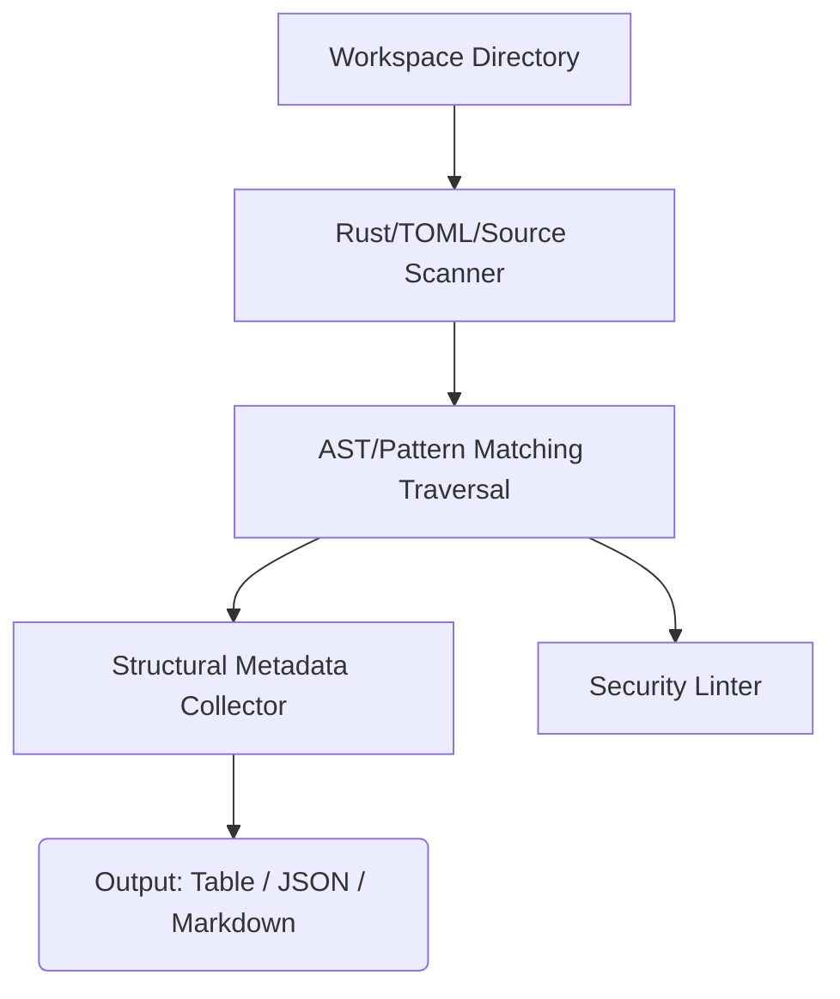

# StellarPath CLI

[](https://github.com/STELLAR-PATH/stellarpath-cli/actions)
[](LICENSE)
[](https://www.rust-lang.org)
[](https://soroban.stellar.org)

## Core Purpose
A deterministic repository intelligence CLI for Stellar and Soroban smart contract workspaces.

## Features

- **Stellar SDK Detection**: Distinguishes between modern Stellar RPC usage and legacy Horizon endpoints by analyzing source files.
- **Soroban Contract Analysis**: Uses static analysis to identify structurally sound patterns (e.g., explicit `require_auth`, typed `enum` storage keys, safe math) and flag anti-patterns (e.g., raw symbol storage key collisions).
- **SEP Implementation Detection**: Identifies whether the codebase implements key Stellar Ecosystem Proposals, currently supporting SEP-10 (Web Auth), SEP-24 (Hosted Deposit/Withdraw), and SEP-53 (Sign-In with Stellar).
- **Security Linting**: A dedicated `lint` mode that checks smart contracts for a subset of the 23 documented Soroban security mistakes (detects bare panics, unsafe unwraps, and missing events).

### Empirical Validation & Benchmark
| Target Architecture | Ecosystem Category | Contracts Detected | Auth Call Sites | Storage Analysis | Scan Latency |
| :--- | :--- | :--- | :--- | :--- | :--- |
| `soroban-examples/auth` | Access Control Reference | 2 (`AuthContract`, `CustomAccount`) | 4 (`require_auth`) | Instance | ~12ms |
| `soroban-examples/token` | SEP-41 Reference | 1 (`Token`) | 6 (`require_auth_for_args`) | Instance / Persistent | ~14ms |
| `soroban-examples/liquidity_pool` | Automated Market Maker | 1 (`LiquidityPool`) | 3 (`require_auth`) | Persistent | ~18ms |

## Architecture & Pipeline



## Quick Start

### Installation

```bash
# Install directly from the repository
cargo install --path .

# Or build the release binary manually
cargo build --release
```

### Usage

Run StellarPath in the root of any Stellar or Soroban repository. The CLI provides three core modes:

1. **Scan**: Analyze what the project is and what components it contains.
```bash
stellarpath-cli scan .
```
*(Format output using `--format json` or `--format markdown`)*

2. **Start**: Get concrete starting recommendations for exploring the codebase.
```bash
stellarpath-cli start .
```

3. **Lint**: Run static security checks for common smart contract mistakes.
```bash
stellarpath-cli lint .
```

### Example Output

```
$ stellarpath-cli
==================================================
StellarPath Analysis Report
==================================================

Project Archetype: Full-Stack Stellar / Soroban Monorepo

Languages Detected:
- Rust
- TypeScript/JavaScript

Recommendations:
1. Review Documentation: Start by reading the project documentation to understand its structure. (Read this file) -> README.md
2. Explore Smart Contracts: Soroban smart contracts are a core part of this project. (Review contract implementation) -> src/contract.rs
3. Run Tests: A Rust project was detected. (cargo test) -> Cargo.toml
==================================================
```

## Project Roadmap
- [x] **v0.1.0:** Core AST detection and heuristic classification
- [x] **v0.1.0:** Terminal, JSON, and Markdown rendering
- [x] **v0.2.0:** Authorization flow graph generation
- [x] **v0.2.0:** Developer telemetry integration
- [x] **v0.2.0:** Custom detector plugin support

## Acknowledgements & Ecosystem

StellarPath is an open-source initiative dedicated to advancing developer tooling, contract architecture inspection, and developer experience across the Stellar and Soroban ecosystems.
